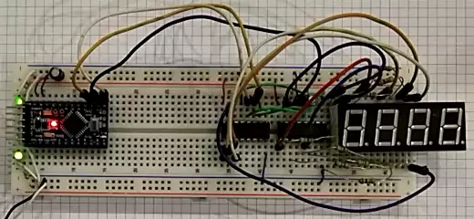

# HAPPY NEW YEAR

مدار تبریک سال نو انجمن علمی کامپیوتر.

<h2 dir="rtl" style="direction: rtl;">مدار</h2>

یک برد آردواینو حروفی که باید روی سون‌سگمنت ها نمایش داده شود را به یک شیفت‌رجیستر می‌فرستد. شیفت رجیستر دوم به صورت زنجیری به قبلی وصل شده و مقدار درون آن مشخص می‌کند کدام یک از رقم های سون‌سگمنت چهار رقمه باید روشن باشد.

<h2 dir="rtl" style="direction: rtl;">کد</h2>

رقم های سون سگمنت به ترتیب هرکدام با حرف مربوط به خود با سرعت بسیار بالا روشن می‌شوند به طوری که چشم انسان تمامی ارقام را همزمان روشن می‌بیند. به این تکنیک «مولتیپلکسینگ» گفته می‌شود.

This repo is for a little [Arduino](https://adruino.cc) project to congratulate the new Persian year on behalf of [CACTB](https://t.me/cactb). 

## The circuit

An Arduino board shifts seven segment bit patterns to 2 daisy-chained shift registers. One seven segment lights up at a time. By sequentially turning every seven segment on it looks like they are all on all the time (multiplexing).
